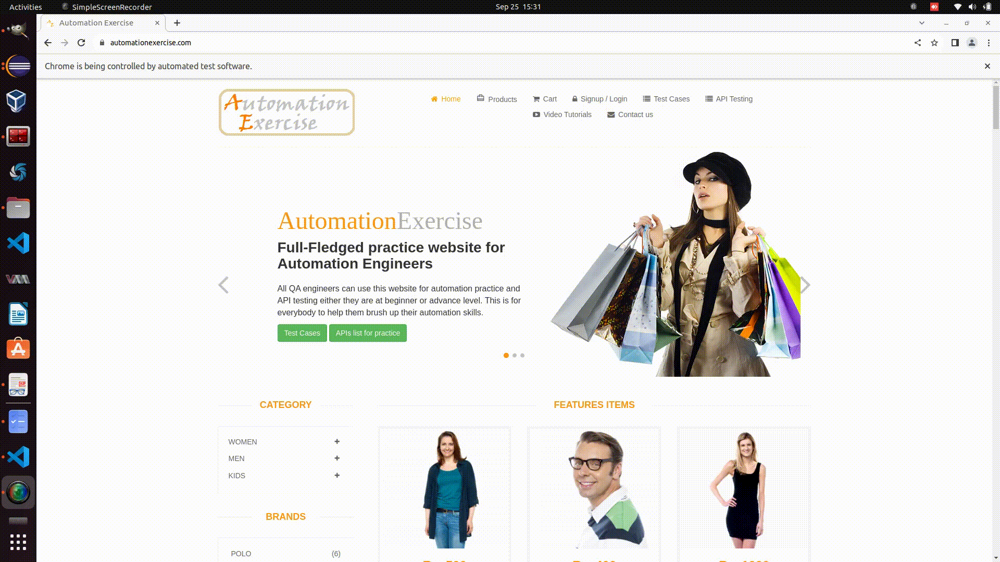

<p align="center">
  <h1 align="center">Automation of AutomationExercise Web Application Using Selenium and TestNG</h1>
  <p align="center">
    A web automation project automating testing processes for the Online Store using Selenium & TestNG in Java.
    <br /><br/>
    <a href="https://www.linkedin.com/in/adityapatel98/">
        </a>
    <a href="https://github.com/Adityapatel-dev">
        </a>
  </p>
</p>
<hr>

## About The Project

This project aims to automate the key functionalities of the [AutomationExercise](https://automationexercise.com/) web application using **Selenium WebDriver** and **TestNG**. It includes automating features like user signup, login, adding products to the cart, placing orders, and generating invoices. **TestNG** organizes test cases, handles assertions, and generates detailed reports for efficient test management.



### Built With

- **Java 8**
- **Maven** for build automation
- **Selenium** for browser automation
- **TestNG** for test management and reporting

## Getting Started

### Prerequisites

- Basic knowledge of **Java**, **Maven**, **Selenium**, and **TestNG**.

### Running the Project

1. **Install Java** (JDK 1.8) using [this guide](https://docs.oracle.com/javase/10/install/installation-jdk-and-jre-microsoft-windows-platforms.htm).
2. **Setup Maven** by following this [installation guide](https://maven.apache.org/install.html).
3. **Clone the repository**:
    ```bash
    git clone https://github.com/Adityapatel-dev/Selenium-projects.git
    ```
4. Open the project in **Eclipse** by selecting “File -> Import -> Maven -> Existing Maven Project.”
5. If "Maven Dependencies" are missing, run:
    ```bash
    mvn clean install
    ```
6. After making changes, package the code:
    ```bash
    mvn clean package
    ```

7. Run the project using:
    ```bash
    mvn clean test
    ```

Alternatively, you can run it as a **TestNG Suite** in **Eclipse**.

### Authors

- **Aditya Lalitkumar Patel** - [GitHub](https://github.com/Adityapatel-dev)

## Contact

[![LinkedIn][linkedin-shield]][linkedin-url]

[linkedin-shield]: https://img.shields.io/badge/-LinkedIn-black.svg?style=for-the-badge&logo=linkedin&colorB=555  
[linkedin-url]: https://www.linkedin.com/in/adityapatel98/
