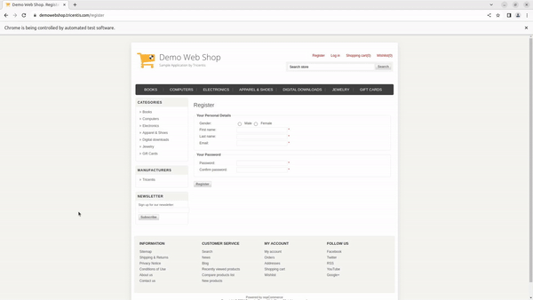

<p align="center">
  <h1 align="center">Automation of DemoWebShop Web Application Using Selenium, TestNG, and Cucumber</h1>
  <p align="center">
    A web automation project automating the testing process of the DemoWebShop E-commerce Web Application using Selenium and TestNG in Java.
    <br /><br/>
    <a href="https://www.linkedin.com/in/adityapatel98/">
        </a>
    <a href="https://github.com/Adityapatel-dev">
        </a>
  </p>
</p>
<hr>

## About The Project

This project automates the [DemoWebShop E-commerce](https://demowebshop.tricentis.com/) application using **Selenium**, **TestNG**, and **Cucumber**. It validates key functionalities like:

- **Register Account**: Automates the account registration process.
- **Login**: Simulates user login.
- **Add Gift Card to Cart**: Adds a product to the cart and verifies updates.
- **Place Order**: Automates checkout, including shipping and payment.



### Built With

- **Java 8**
- **Maven**
- **Selenium**
- **TestNG**
- **Cucumber**

## Getting Started

### Prerequisites

- Basic knowledge of Java, Maven, Selenium, Cucumber, and TestNG.

### Running the Project

1. **Install Java JDK 1.8**. Follow [this guide](https://docs.oracle.com/javase/10/install/installation-jdk-and-jre-microsoft-windows-platforms.htm).
2. **Setup Maven**: [Install Maven](https://maven.apache.org/install.html).
3. **Clone the Repository**:
    ```bash
    git clone https://github.com/Adityapatel-dev/Selenium-projects.git
    ```
4. Open the project in **Eclipse** using **"File -> Import -> Maven -> Existing Maven Project"**.
5. Run:
    ```bash
    mvn clean install
    ```
6. To execute tests:
    ```bash
    mvn clean test
    ```
7. Optionally, package into a JAR:
    ```bash
    mvn clean package
    ```

### TestNG Execution

You can run this project as a **TestNG Suite** in **Eclipse**.

## Authors

- **Aditya Lalitkumar Patel** - [GitHub](https://github.com/Adityapatel-dev)

## Contact

[![LinkedIn][linkedin-shield]][linkedin-url]

[linkedin-shield]: https://img.shields.io/badge/-LinkedIn-black.svg?style=for-the-badge&logo=linkedin&colorB=555  
[linkedin-url]: https://www.linkedin.com/in/adityapatel98/

