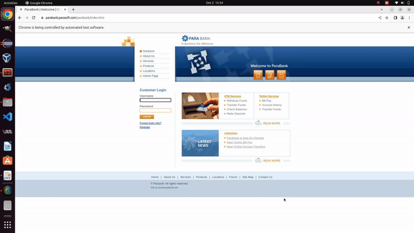

<p align="center">
  <h1 align="center">Parabank Online Web Application (Data-Driven with Cucumber)</h1>
  <p align="center">
    A web automation project automating the testing process of the Para Bank web application using Selenium, TestNG, and Cucumber in Java.
    <br /><br/>
    <a href="https://www.linkedin.com/in/adityapatel98/">
        </a>
    <a href="https://github.com/Adityapatel-dev">
        </a>
  </p>
</p>
<hr>

## About The Project

In this project, we automate essential functions of the [Parabank online banking application](https://parabank.parasoft.com/parabank/index.htm) using Selenium, TestNG, and Cucumber, focusing on:

- **Register a New Account**: Automates the process using data-driven testing with multiple user data sets.
- **Login to Application**: Validates login functionality with varied credentials.
- **Create a New Savings Account**: Automates the account creation process.
- **Transfer Amount Between Accounts**: Transfers funds between accounts using automated scripts.



### Built With

- **Java 8**
- **Maven**
- **Selenium**
- **TestNG**
- **Cucumber**

## Getting Started

### Prerequisites

- Basic knowledge of Java, Maven, Selenium, TestNG, and Cucumber.

### Running the Project

1. **Install Java JDK 1.8** ([Guide](https://docs.oracle.com/javase/10/install/installation-jdk-and-jre-microsoft-windows-platforms.htm)).
2. **Setup Maven** ([Install](https://maven.apache.org/install.html)).
3. **Clone the Repository**:
    ```bash
    git clone https://github.com/Adityapatel-dev/Selenium-projects.git
    ```
4. **Import the Project** in **Eclipse** via **"File -> Import -> Maven -> Existing Maven Project"**.
5. **Build and Install Dependencies**:
    ```bash
    mvn clean install
    ```
6. **Execute Tests**:
    ```bash
    mvn clean test
    ```
7. **Package into JAR** (Optional):
    ```bash
    mvn clean package
    ```

### TestNG Execution

You can also run the project as a **TestNG Suite** in **Eclipse**.

## Authors

- **Aditya Lalitkumar Patel** - [GitHub](https://github.com/Adityapatel-dev)

## Contact

[![LinkedIn][linkedin-shield]][linkedin-url]

[linkedin-shield]: https://img.shields.io/badge/-LinkedIn-black.svg?style=for-the-badge&logo=linkedin&colorB=555  
[linkedin-url]: https://www.linkedin.com/in/adityapatel98/
