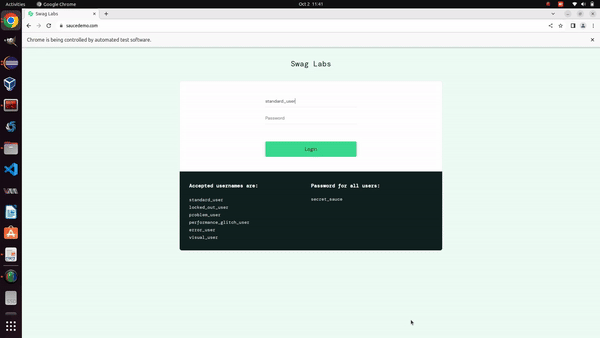

<p align="center">
  <h1 align="center">Automation of SwagLab Web Application Using Selenium and TestNG</h1>
  <p align="center">
    A web automation project automating the testing of the SwagLab E-commerce web application using Selenium and TestNG in Java.
    <br /><br/>
    <a href="https://www.linkedin.com/in/adityapatel98/">
        </a>
    <a href="https://github.com/Adityapatel-dev">
        </a>
  </p>
</p>
<hr>

## About The Project

The automation of the [SwagLab e-commerce](https://www.saucedemo.com/) web application focuses on testing functionalities such as login, adding products to the cart, and placing orders. Selenium is used for automating web interactions, while TestNG manages test execution and reporting.

- **Login**: Automates login functionality with valid credentials.
- **Add Product to Cart**: Automates product selection and validation.
- **Place Order**: Automates checkout and order confirmation.



### Built With

- **Java 8**
- **Maven**
- **Selenium**
- **TestNG**

## Getting Started

### Prerequisites

Basic understanding of Java, Maven, Selenium, and TestNG.

### Running the Project

1. **Install Java JDK 1.8** ([Guide](https://docs.oracle.com/javase/10/install/installation-jdk-and-jre-microsoft-windows-platforms.htm)).
2. **Setup Maven** ([Install](https://maven.apache.org/install.html)).
3. **Clone the Repository**:
    ```bash
    git clone https://github.com/Adityapatel-dev/Selenium-projects.git
    ```
4. **Import the Project** in **Eclipse** via **"File -> Import -> Maven -> Existing Maven Project"**.
5. **Build and Install Dependencies**:
    ```bash
    mvn clean install
    ```
6. **Execute Tests**:
    ```bash
    mvn clean test
    ```
7. **Package into JAR** (Optional):
    ```bash
    mvn clean package
    ```

### TestNG Execution

You can also run the project as a **TestNG Suite** in **Eclipse**.

## Authors

- **Aditya Lalitkumar Patel** - [GitHub](https://github.com/Adityapatel-dev)

## Contact

[![LinkedIn][linkedin-shield]][linkedin-url]

[linkedin-shield]: https://img.shields.io/badge/-LinkedIn-black.svg?style=for-the-badge&logo=linkedin&colorB=555  
[linkedin-url]: https://www.linkedin.com/in/adityapatel98/
